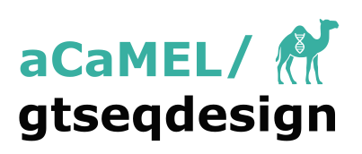
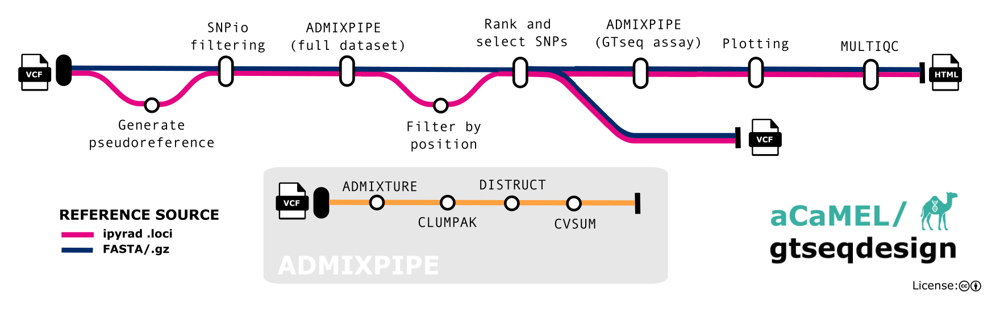

<<<<<<< HEAD
<h1>
  <picture>
    <source media="(prefers-color-scheme: dark)" srcset="docs/images/acamel_gtseqdesign_logo_dark.png">
    
  </picture>
</h1>

[](https://github.com/aCaMEL/gtseqdesign/actions/workflows/ci.yml)
[](https://github.com/aCaMEL/gtseqdesign/actions/workflows/linting.yml)[](https://doi.org/10.5281/zenodo.XXXXXXX)
=======
[](https://github.com/aCaMEL/acamel-gtseqdesign/actions/workflows/ci.yml)
[](https://github.com/aCaMEL/acamel-gtseqdesign/actions/workflows/linting.yml)[](https://doi.org/10.5281/zenodo.XXXXXXX)
>>>>>>> TEMPLATE
[](https://www.nf-test.com)

[](https://www.nextflow.io/)
[](https://docs.conda.io/en/latest/)
[](https://www.docker.com/)
[](https://sylabs.io/docs/)
[](https://cloud.seqera.io/launch?pipeline=https://github.com/aCaMEL/acamel-gtseqdesign)

## Introduction

<<<<<<< HEAD
**aCaMEL/gtseqdesign** is a Nextflow pipeline for GT-seq panel design. It filters and scores SNPs based on their utility for distinguishing population structure, using metrics from **Rosenberg et al. (2003)** and structure results from **ADMIXTURE**.
=======
**aCaMEL/acamel-gtseqdesign** is a bioinformatics pipeline that ...
>>>>>>> TEMPLATE

The pipeline takes VCF and population map inputs and produces filtered SNP panels, summary figures, and MultiQC reports.

### Overview



### Main Steps

1. Optional psuedo-reference generation from reduced-representation catalogs (when FASTA reference unavailable)
2. SNP filtering using [SNPio](https://github.com/btmartin721/SNPio)
3. Population inference using [ADMIXTURE](https://dalexander.github.io/admixture/) via [AdmixPipe](https://github.com/stevemussmann/admixturePipeline)
4. Cluster alignment with [CLUMPAK](https://clumpak.tau.ac.il) and visualization with [Distruct](https://rosenberglab.stanford.edu/distruct.html)
5. Locus ranking with [infocalc](https://rosenberglab.stanford.edu/infocalc.html) (Rosenberg et al. 2003)
6. Panel selection and downstream re-analysis
7. Summary output with [MultiQC](https://docs.seqera.io/multiqc#data-as-part-of-multiqc-config)

## Usage

## Quick Start

1. Install [`Nextflow`](https://www.nextflow.io/docs/latest/getstarted.html#installation) (`>=22.10.1`)

2. Install any of [`Docker`](https://docs.docker.com/engine/installation/), [`Singularity`](https://www.sylabs.io/guides/3.0/user-guide/) (you can follow [this tutorial](https://singularity-tutorial.github.io/01-installation/)), [`Podman`](https://podman.io/), [`Shifter`](https://nersc.gitlab.io/development/shifter/how-to-use/) or [`Charliecloud`](https://hpc.github.io/charliecloud/) for full pipeline reproducibility _(you can use [`Conda`](https://conda.io/miniconda.html) both to install Nextflow itself and also to manage software within pipelines. Please only use it within pipelines as a last resort; see [docs](https://nf-co.re/usage/configuration#basic-configuration-profiles))_.

3. Download and test the pipeline on a minimal dataset with a single command:

   ```bash
   nextflow run UARK-aCaMEL/gtseqdesign -profile test,YOURPROFILE --outdir <OUTDIR>
   ```

   Note that some form of configuration will be needed so that Nextflow knows how to fetch the required software. This is usually done in the form of a config profile (`YOURPROFILE` in the example command above). You can chain multiple config profiles in a comma-separated string.

   > - The pipeline comes with config profiles called `docker`, `singularity`, `podman`, `shifter`, `charliecloud` and `conda` which instruct the pipeline to use the named tool for software management. For example, `-profile test,docker`.
   > - Please check [nf-core/configs](https://github.com/nf-core/configs#documentation) to see if a custom config file to run nf-core pipelines already exists for your Institute. If so, you can simply use `-profile <institute>` in your command. This will enable either `docker` or `singularity` and set the appropriate execution settings for your local compute environment.
   > - If you are using `singularity`, please use the [`nf-core download`](https://nf-co.re/tools/#downloading-pipelines-for-offline-use) command to download images first, before running the pipeline. Setting the [`NXF_SINGULARITY_CACHEDIR` or `singularity.cacheDir`](https://www.nextflow.io/docs/latest/singularity.html?#singularity-docker-hub) Nextflow options enables you to store and re-use the images from a central location for future pipeline runs.
   > - If you are using `conda`, it is highly recommended to use the [`NXF_CONDA_CACHEDIR` or `conda.cacheDir`](https://www.nextflow.io/docs/latest/conda.html) settings to store the environments in a central location for future pipeline runs.

4. Start running your own analysis!

   ```bash
   nextflow run main.nf --input genotypes.vcf --popmap popmap.tsv --reference genome.fasta --outdir <OUTDIR> -profile <docker/singularity/podman/shifter/charliecloud/conda/institute>
   ```

> [!NOTE]
> If you are new to Nextflow and nf-core, please refer to [this page](https://nf-co.re/docs/usage/installation) on how to set-up Nextflow. Make sure to [test your setup](https://nf-co.re/docs/usage/introduction#how-to-run-a-pipeline) with `-profile test` before running the workflow on actual data.

<<<<<<< HEAD
=======
<!-- TODO nf-core: Describe the minimum required steps to execute the pipeline, e.g. how to prepare samplesheets.
     Explain what rows and columns represent. For instance (please edit as appropriate):

First, prepare a samplesheet with your input data that looks as follows:

`samplesheet.csv`:

```csv
sample,fastq_1,fastq_2
CONTROL_REP1,AEG588A1_S1_L002_R1_001.fastq.gz,AEG588A1_S1_L002_R2_001.fastq.gz
```

Each row represents a fastq file (single-end) or a pair of fastq files (paired end).

-->

Now, you can run the pipeline using:

<!-- TODO nf-core: update the following command to include all required parameters for a minimal example -->

```bash
nextflow run aCaMEL/acamel-gtseqdesign \
   -profile <docker/singularity/.../institute> \
   --input samplesheet.csv \
   --outdir <OUTDIR>
```
>>>>>>> TEMPLATE

> [!WARNING]
> Please provide pipeline parameters via the CLI or Nextflow `-params-file` option. Custom config files including those provided by the `-c` Nextflow option can be used to provide any configuration _**except for parameters**_;
> see [docs](https://nf-co.re/usage/configuration#custom-configuration-files).

## Credits

<<<<<<< HEAD
aCaMEL/gtseqdesign was originally written by [Tyler K. Chafin](https://github.com/tkchafin).
=======
aCaMEL/acamel-gtseqdesign was originally written by Tyler K. Chafin.
>>>>>>> TEMPLATE

We thank the following people for their extensive assistance in the development of this pipeline:

- [Bradley Martin](https://github.com/btmartin721) for fixes and container for SNPio

## Contributions and Support

If you would like to contribute to this pipeline, please see the [contributing guidelines](.github/CONTRIBUTING.md).

## Citations

<!-- TODO nf-core: Add citation for pipeline after first release. Uncomment lines below and update Zenodo doi and badge at the top of this file. -->
<!-- If you use aCaMEL/acamel-gtseqdesign for your analysis, please cite it using the following doi: [10.5281/zenodo.XXXXXX](https://doi.org/10.5281/zenodo.XXXXXX) -->

<!-- TODO nf-core: Add bibliography of tools and data used in your pipeline -->

An extensive list of references for the tools used by the pipeline can be found in the [`CITATIONS.md`](CITATIONS.md) file.

This pipeline uses code and infrastructure developed and maintained by the [nf-core](https://nf-co.re) community, reused here under the [MIT license](https://github.com/nf-core/tools/blob/master/LICENSE).

> **The nf-core framework for community-curated bioinformatics pipelines.**
>
> Philip Ewels, Alexander Peltzer, Sven Fillinger, Harshil Patel, Johannes Alneberg, Andreas Wilm, Maxime Ulysse Garcia, Paolo Di Tommaso & Sven Nahnsen.
>
> _Nat Biotechnol._ 2020 Feb 13. doi: [10.1038/s41587-020-0439-x](https://dx.doi.org/10.1038/s41587-020-0439-x).
